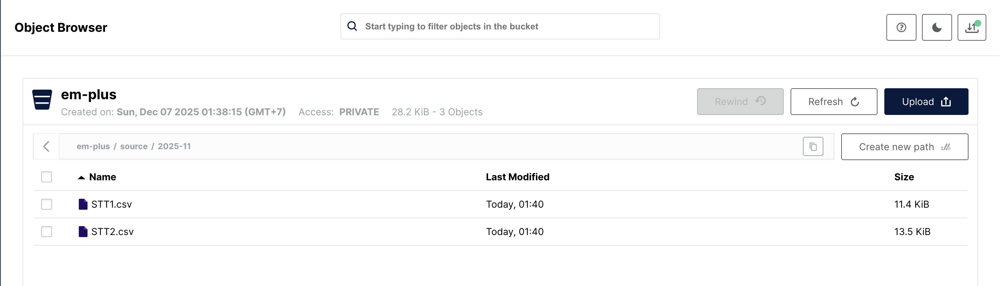
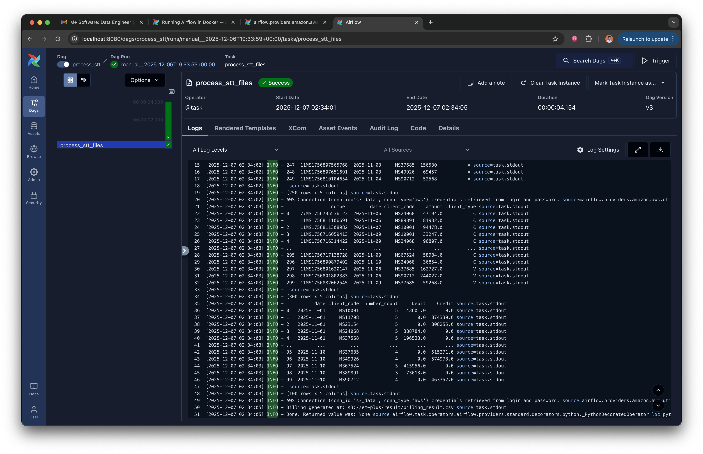
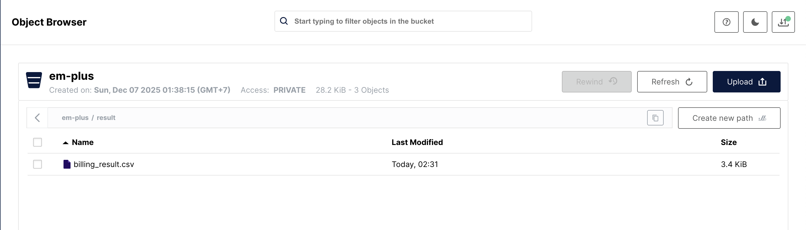

# M+ Data Engineer Coding Skill Test

The project implements an Apache Airflow DAG that processes STT data from CSV files stored in an S3 storage and generates billing reports.

## Project Overview

The data pipeline performs the following operations:
1. Reads STT data from two CSV files (`STT1.csv` and `STT2.csv`) stored in S3
2. Merges and deduplicates the data based on the `number` field
3. Performs data aggregation by date, client code, and client type
4. Calculates debit and credit amounts based on client type (C, V)
5. Generates a billing summary report and saves it back to S3

## Prerequisites

- Docker and Docker Compose installed
- At least 4GB RAM and 2 CPU cores available for Docker
- S3-compatible storage with your personal bucket named "em-plus"

## Setup Instructions

### 1. Repository Setup

First, clone this repository and navigate to the project directory:

```bash
git clone <repository-url>
cd em-plus
```

### 2. Airflow Directory Setup

Create the necessary directories for Airflow:

```bash
mkdir -p ./dags ./logs ./plugins ./config
echo -e "AIRFLOW_UID=$(id -u)" > .env
```

### 3. S3 Configuration

You need to configure an S3 connection in Airflow to connect to your personal S3 bucket:

1. Start Airflow (see next section)
2. Navigate to Airflow UI at `http://localhost:8080`
3. Go to **Admin** → **Connections**
4. Create a new connection with the following settings:
   - **Connection Id**: `s3_data`
   - **Connection Type**: `Amazon Web Services`
   - **AWS Secret Access Key**: Your S3 secret access key
   - **AWS Access Key ID**: Your S3 access key ID

### 4. Data Preparation

Ensure your S3 bucket named `em-plus` has the following structure:

```
em-plus/
└── source/
    └── 2025-11/
        ├── STT1.csv
        └── STT2.csv
```

### 5. Start Airflow

Launch the Airflow infrastructure using Docker Compose:

```bash
docker-compose up -d
```

Wait for all services to be healthy (this may take a few minutes). You can check the status with:

```bash
docker-compose ps
```

## Data Flow

### Source Data Structure

The STT CSV files contain the following columns:
- `number`: Unique identifier (used for deduplication)
- `date`: Transaction date
- `client_code`: Client identifier
- `client_type`: Client type ('C', 'V')
- `amount`: Transaction amount
- `source`: Source file identifier (added during processing)

### Processing Steps

1. **Data Loading**: Read CSV files from S3 using `S3Hook`
2. **Source Tagging**: Add source identifier to each record
3. **Data Merging**: Combine STT1 and STT2 data
4. **Data Cleaning**: Remove incomplete records (drop NaN values)
5. **Deduplication**: Keep last occurrence for each `number` (prioritizes STT2)
6. **Date Processing**: Convert date column to datetime format
7. **Aggregation**: Group by date, client_code, and client_type
8. **Financial Calculation**: Separate debit and credit amounts
9. **Output Generation**: Create billing summary and upload to S3

### Output Structure

The final billing report (`billing_result.csv`) contains:
- `date`: Transaction date
- `client_code`: Client identifier
- `number_count`: Count of transactions per client
- `Debit`: Total debit amount (client_type 'C')
- `Credit`: Total credit amount (client_type 'V')

## Screenshots

The following screenshots demonstrate the successful execution of the pipeline:

### Source Data in MinIO

*STT1.csv and STT2.csv files in the em-plus bucket*

### Airflow DAG Execution

*Successful DAG execution logs*

### Result Data in MinIO

*Generated billing_result.csv file*

## Testing

### Manual DAG Trigger

1. Access Airflow UI at `http://localhost:8080`
2. Enable the `process_stt` DAG
3. Click the trigger button to run the DAG manually
4. Monitor the execution in the Grid view and check logs

### Verify Output

After successful execution:
1. Check your S3 bucket for the `result/billing_result.csv` file
2. Verify the data matches expected aggregation results

## Monitoring and Logging

- **Airflow UI**: `http://localhost:8080` - Monitor DAG runs and task status
- **Logs**: View logs in Airflow UI or in `./logs` directory

## Notes

- This implementation uses a self-hosted, personal MinIO S3-compatible storage
- The DAG is configured for manual execution (no schedule)
- Data deduplication prioritizes STT2 over STT1 for duplicate `number` values
- Client type 'C' is treated as Debit, 'V' as Credit in the final report
